## 🎵 Yin Pitch Tracker — Browser + CLI

Lightweight pitch detection powered by the YIN algorithm. Record or upload audio in the browser, or analyze `.wav` files via Node. JSON export, note names, and deviation in cents are included out of the box.

---

### Highlights

- Record up to 5 seconds or upload `.wav` (stereo → mono, trims first 0.3s attack)
- Real-time live tuner mode
- YIN implementation with confidence scoring, smoothing, and note/deviation reporting
- Downloadable JSON results; save recordings as WAV
- Node CLI for offline analysis

---

### Quick Start

```bash
npm install
npm run build
npx tsc --project tsconfig.frontend.json   # browser bundle
```

Serve the repo with any static server, e.g.:

````bash
npx http-server .
# then open:
## 🎵 Yin Pitch Tracker — Browser + CLI

 

Lightweight pitch detection powered by the YIN algorithm. Record or upload audio in the browser, or analyze `.wav` files via Node. JSON export, note names, and deviation in cents are included out of the box.

---

## Table of Contents
- [Highlights](#highlights)
- [Quick Start](#quick-start)
- [Browser Usage](#using-the-browser-app)
- [CLI](#cli)
- [YIN Processing (brief)](#yin-processing-brief)
- [Project Layout](#project-layout)
- [For Collaborators](#for-collaborators)
- [Contributing & Improvements](#contributing--improvements)

---

### Highlights
- Record up to 5 seconds or upload `.wav` (stereo → mono, trims first 0.3s attack)
- Real-time live tuner mode
- YIN implementation with confidence scoring, smoothing, and note/deviation reporting
- Downloadable JSON results; save recordings as WAV
- Node CLI for offline analysis

---

### Quick Start
Install dependencies and build the project:

```powershell
npm install
npm run build
npx tsc --project tsconfig.frontend.json   # browser bundle
````

Serve the repo locally and open the browser app:

```powershell
npx http-server .
# then open in browser:
# http://localhost:8080/src/frontend/index.html
```

---

### Using the Browser App

1. Choose File: upload a `.wav`, optionally provide an Expected Note (e.g., `C4` or `440`), then click Analyze, Playback, or Download JSON.
2. Record: record up to 5 seconds, stop early if needed, analyze, playback, or save as WAV.
3. Live Tuner: start/stop live analysis; leaving the tab stops capture.
4. Audio Devices: pick input/output devices (browser permission required).

---

### CLI

Analyze a local file with the included Node CLI:

```powershell
node dist/cli/analyze.js --file myfile.wav
```

---

### YIN Processing (brief)

- Difference → CMND → threshold to find τ
- Parabolic interpolation for sub-sample accuracy
- Convert lag to F₀, derive confidence, map to note + cents deviation
- Optional filters, normalization, RMS, and smoothing

---

### Project Layout

```
src/
  core/
    yin.ts
    pitch-engine.ts
    note-utils.ts
    dsp/
      dsp-config.ts
      filters.ts
      noise.ts
      rms.ts
      smoothing.ts
  cli/
    analyze.ts
  frontend/
    app.ts
    index.html

dist/   (auto-generated)
```

---

### JSON Schema for Backend

```
{
  "$schema": "https://json-schema.org/draft/2020-12/schema",
  "title": "PitchAnalysisResult",
  "type": "object",
  "properties": {
    "frequency": {
      "type": ["number", "null"],
      "description": "Detected fundamental frequency (Hz)"
    },
    "note": {
      "type": ["string", "null"],
      "description": "Detected musical note (e.g. 'C4')"
    },
    "confidence": {
      "type": "number",
      "minimum": 0,
      "maximum": 1,
      "description": "YIN detection probability"
    },
    "expectedNote": {
      "type": ["string", "null"],
      "description": "User-provided expected note or Hz"
    },
    "deviation": {
      "type": ["string", "null"],
      "description": "Pitch difference from expected note (in cents)"
    },
    "sampleRate": {
      "type": "number",
      "description": "Sample rate of analyzed audio"
    },
    "frameRMS": {
      "type": ["number", "null"],
      "description": "Amplitude of the frame after filtering"
    },
    "source": {
      "type": "string",
      "enum": ["none", "upload", "recording"],
      "description": "Where the analyzed audio came from"
    },
    "timestamp": {
      "type": "string",
      "format": "date-time",
      "description": "Time when the analysis occurred"
    }
  },
  "required": ["confidence", "sampleRate", "source", "timestamp"]
}
```

### Feature Tree (Mermaid)

```mermaid
flowchart TD
  A[Yin Pitch Tracker] --> B[Browser App]
  A --> C[CLI]
  A --> D[Core DSP/Pitch]
  B --> B1[Modes: File / Record / Live Tuner]
  B --> B2[Analysis: PitchEngine + expected note]
  B --> B3[Playback + WAV save + JSON export]
  B --> B4[Audio devices: list/select input/output]
  C --> C1[Command tuner-analyze <file>]
  C --> C2[Options: --expected, --verbose, --json]
  C --> C3[Stereo→mono, trim 0.3s, scan frames]
  D --> D1[PitchEngine: filters → YIN → smoothing → note/deviation]
  D --> D2[YIN detector: diff → CMND → threshold → parabola]
  D --> D3[DSP utils: filters, noise gate, normalization, RMS, smoothing]
  D --> D4[Note utils: Hz↔note, expected note parsing, cents]
```



# 🙋 For Collaborators

After cloning:

````
## For Collaborators

After cloning, run the following to build and preview locally:

```powershell
npm install
npm run build
npx tsc --project tsconfig.frontend.json
npx http-server .
````

Open the browser at:

http://localhost:8080/src/frontend/index.html

Works on:

- macOS
- Linux
- Windows

---

## Contributing & Improvements

If you'd like to contribute or try improvements, here are a few good next steps:

- Review per-file docs in `/docs/core/` for implementation notes and suggested enhancements.
- Performance: limit YIN tau search range, reuse internal buffers, or replace difference computation with an FFT-based approach for large frames.
- Audio quality: add pre-filtering (DC remove / windowing), adaptive smoothing based on confidence, or hysteresis on noise gate.
- Filters: cache `BiquadFilter` instances instead of recreating per-frame to preserve state and reduce allocation churn.

If you'd like, open an issue with the feature idea and I can help implement it.

---

## License

MIT — see `LICENSE` (or add one if you want this repository publicly licensed).
