## 🎵 Yin Pitch Tracker — Browser + CLI

Lightweight pitch detection powered by the YIN algorithm. Record or upload audio in the browser, or analyze `.wav` files via Node. JSON export, note names, and deviation in cents are included out of the box.

---

### Highlights

- (Upload File mode) Choose File (.wav) for analysis of single tone
- (Record mode) Record up to 5 seconds or upload `.wav` (stereo → mono, trims first 0.3s attack)
- (Live Tuner mode) Real-time live tuner mode
- YIN implementation with confidence probability, smoothing, and note/deviation reporting
- Downloadable JSON results; save recordings as WAV (Record mode only)
- Node CLI for offline analysis

---

 

Lightweight pitch detection powered by the YIN algorithm. Record or upload audio in the browser, or analyze `.wav` files via Node. JSON export, note names, and deviation in cents are included out of the box.

---

## Table of Contents

- [Highlights](#highlights)
- [Quick Start](#quick-start)
- [Browser Usage](#using-the-browser-app)
- [CLI](#cli)
- [YIN Processing (brief)](#yin-processing-brief)
- [Project Layout](#project-layout)
- [For Collaborators](#for-collaborators)
- [Contributing & Improvements](#contributing--improvements)

---

### Highlights

- Record up to 5 seconds or upload `.wav` (stereo → mono, trims first 0.3s attack)
- Real-time live tuner mode
- YIN implementation with confidence scoring, smoothing, and note/deviation reporting
- Downloadable JSON results; save recordings as WAV
- Node CLI for offline analysis

---

### Quick Start

Install dependencies and build the project:

```powershell
npm install
npm run build
npx tsc --project tsconfig.frontend.json   # browser bundle
```

Serve the repo locally and open the browser app:

```powershell
npx http-server .
# then open in browser:
# http://localhost:8080/src/frontend/index.html
```

---

### Using the Browser App

1. Choose File: upload a `.wav`, optionally provide an Expected Note (e.g., `C4` or `440`), then click Analyze, Playback, or Download JSON.
2. Record: record up to 5 seconds, stop early if needed, analyze, playback, or save as WAV.
3. Live Tuner: start/stop live analysis; leaving the tab stops capture.
4. Audio Devices: pick input/output devices (browser permission required).

---

### CLI

Analyze a local file with the included Node CLI:

```powershell
node dist/cli/analyze.js --file myfile.wav
```

---

### YIN Processing (brief)

- Difference → CMND → threshold to find τ
- Parabolic interpolation for sub-sample accuracy
- Convert lag to F₀, derive confidence, map to note + cents deviation
- Optional filters, normalization, RMS, and smoothing

---

### Project Layout

```
src/
  core/
    yin.ts
    pitch-engine.ts
    note-utils.ts
    dsp/
      dsp-config.ts
      filters.ts
      noise.ts
      rms.ts
      smoothing.ts
  cli/
    analyze.ts
  frontend/
    app.ts
    index.html

dist/   (auto-generated)
```

---

### JSON Schema for Backend

```
{
  "$schema": "https://json-schema.org/draft/2020-12/schema",
  "title": "PitchAnalysisResult",
  "type": "object",
  "properties": {
    "frequency": {
      "type": ["number", "null"],
      "description": "Detected fundamental frequency (Hz)"
    },
    "note": {
      "type": ["string", "null"],
      "description": "Detected musical note (e.g. 'C4')"
    },
    "confidence": {
      "type": "number",
      "minimum": 0,
      "maximum": 1,
      "description": "YIN detection probability"
    },
    "expectedNote": {
      "type": ["string", "null"],
      "description": "User-provided expected note or Hz"
    },
    "deviation": {
      "type": ["string", "null"],
      "description": "Pitch difference from expected note (in cents)"
    },
    "sampleRate": {
      "type": "number",
      "description": "Sample rate of analyzed audio"
    },
    "frameRMS": {
      "type": ["number", "null"],
      "description": "Amplitude of the frame after filtering"
    },
    "source": {
      "type": "string",
      "enum": ["none", "upload", "recording"],
      "description": "Where the analyzed audio came from"
    },
    "timestamp": {
      "type": "string",
      "format": "date-time",
      "description": "Time when the analysis occurred"
    }
  },
  "required": ["confidence", "sampleRate", "source", "timestamp"]
}
```

### Feature Tree (Mermaid)

```mermaid
flowchart TD
  A[Yin Pitch Tracker] --> B[Browser App]
  A --> C[CLI]
  A --> D[Core DSP/Pitch]
  B --> B1[Modes: File / Record / Live Tuner]
  B --> B2[Analysis: PitchEngine + expected note]
  B --> B3[Playback + WAV save + JSON export]
  B --> B4[Audio devices: list/select input/output]
  C --> C1[Command tuner-analyze <file>]
  C --> C2[Options: --expected, --verbose, --json]
  C --> C3[Stereo→mono, trim 0.3s, scan frames]
  D --> D1[PitchEngine: filters → YIN → smoothing → note/deviation]
  D --> D2[YIN detector: diff → CMND → threshold → parabola]
  D --> D3[DSP utils: filters, noise gate, normalization, RMS, smoothing]
  D --> D4[Note utils: Hz↔note, expected note parsing, cents]
```



# 🙋 For Collaborators

After cloning, run the following to build and preview locally:

```
npm install
npm run build
npx tsc --project tsconfig.frontend.json
npx http-server .
```

Open the browser at:

http://localhost:8080/src/frontend/index.html

Works on:

- macOS
- Linux
- Windows

---

## Contributing & Improvements

If you'd like to contribute or try improvements, here are a few good next steps:

- Review per-file docs in `/docs/core/` for implementation notes and suggested enhancements.
- Performance: limit YIN tau search range, reuse internal buffers, or replace difference computation with an FFT-based approach for large frames.
- Audio quality: add pre-filtering (DC remove / windowing), adaptive smoothing based on confidence, or hysteresis on noise gate.
- Filters: cache `BiquadFilter` instances instead of recreating per-frame to preserve state and reduce allocation churn.

If you'd like, open an issue with the feature idea and I can help implement it.

---

## Documentation

Authoritative docs live in the `docs/` folder:

- `docs/index.html` / `docs/index.md`: project overview and entry point (open the HTML in a browser for a quick tour).
- `docs/YIN.md`: DSP + YIN algorithm walkthrough that backs the detector.
- `docs/frontend-flow.md`: UI flow diagrams and event wiring.
- `docs/core/`: per-file notes for the shared DSP + utilities.

You can open the Markdown files in any editor, or load the HTML versions directly in a browser for a styled experience.

---

## Screenshot


---

## Adding Screenshots

1. Drop `.png` or `.jpg` files into a folder such as `docs/screenshots/` (create it if needed) so they live alongside the rest of the docs assets.
2. Reference them from Markdown (including this `readme.md`) with a relative path, e.g. `` or the HTML `` tag if you need sizing.
3. When you serve the repo locally with `npx http-server .`, those relative paths resolve automatically, so the screenshots show up both on GitHub and in your local docs site.

---

## Frontend Automation Tests

- Deterministic WAV fixtures live in `tests/fixtures/`. `.gitignore` ignores loose `.wav` files but explicitly allows this folder so committed fixtures stay versioned.
- Configure scenarios inside `tests/frontend-testcases.json`. The default config reuses `tests/fixtures/frontend-test.wav` twice—first for a passing **file** mode case, then for a failing **record** mode case—matching the “same input, two modes” workflow you described.
- Run `npm run test:frontend` to build the core code and execute `tests/frontend-automation.mjs`. Each case prints PASS/FAIL along with detected pitch, confidence, and cents from the expectation.
- Swap in your own `.wav` files by dropping them into `tests/fixtures/` and adjusting `defaultWav` (or per-case `wavPath`) along with the expected note/confidence thresholds.

---

## Installing Node.js & npm

The project targets Node 18+, which bundles npm. If you don't already have them, install via:

- **Windows**: Download the LTS installer from https://nodejs.org/, run it, and reopen your terminal. Alternatively, `winget install OpenJS.NodeJS.LTS` or `choco install nodejs-lts` (Chocolatey) work on Windows 10/11.
- **macOS**: Use Homebrew (`brew install node@18`) or grab the LTS `.pkg` installer from https://nodejs.org/.
- **Linux**: Use your package manager (e.g., `sudo apt install nodejs npm` on Ubuntu/Debian, `sudo dnf install nodejs` on Fedora) or install the tarball from https://nodejs.org/.

Verify the install with `node -v` and `npm -v`. Once both commands print versions, you're ready to run `npm install`.

---

## License

[](https://creativecommons.org/licenses/by-nc/4.0/)
You may not use the material for commercial purposes.
https://creativecommons.org/licenses/by-nc/4.0/
